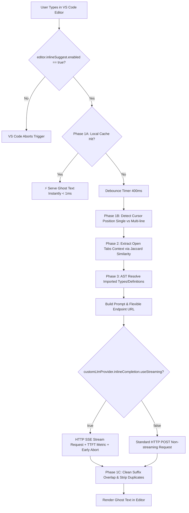

# Custom LLM Provider for GitHub Copilot Chat & VS Code

A powerful VS Code extension that registers custom LLM models from any OpenAI-compatible API endpoint directly into **GitHub Copilot Chat** and provides **Intelligence-Powered Ghost Text Inline Completion (Auto-Complete)**.

---

## 🌟 Key Features

### 💬 Chat Provider (`vscode.lm` Copilot Chat)
- **Multi-Endpoint & Multi-Provider Support**: Connect multiple OpenAI-compatible servers simultaneously (e.g., local Ollama, LM Studio, vLLM, OpenRouter, DeepSeek, Groq) with custom model prefixes.
- **Model Aliases**: Assign short, memorable names for complex model IDs.
- **Vision / Image Input**: Full support for `vscode.LanguageModelImagePart` (automatic Base64 image conversion).
- **Tool / Function Calling**: Native integration with VS Code Chat tools (`openai-tools`, `openai-functions`, or `text-based`).
- **Reasoning / Thinking Tokens**: Renders thinking process from models like DeepSeek-R1, OpenAI o1, or Anthropic inside clean Markdown blockquotes.
- **Auto-Retry Logic**: Automatic backoff retries (fixed/linear/exponential) for HTTP 429/5xx errors or network drops.
- **Accurate Token Counting**: High-precision token estimation using `js-tiktoken` (`cl100k_base`).

### ⚡ Intelligence-Powered Inline Completion (Ghost Text Auto-Complete)
- **Ultra-Fast Local Caching (Phase 1A)**: Instant (< 1ms) ghost text reuse when typing characters that match previous suggestions without calling the API.
- **Dynamic Scope Tuning (Phase 1B)**: Automatically restricts to **Single-Line** (`stop: ['\n']`) when editing mid-line, or **Multi-Line / Full Block** when typing on a new line.
- **Suffix Overlap Deduplication (Phase 1C)**: Cleans up duplicate closing brackets `);`, `}`, `]` that already exist to the right of the cursor.
- **Neighboring Open Tabs Context (Phase 2)**: Reads relevant code snippets from other open editor tabs using **Jaccard Similarity** token matching.
- **AST Go-To-Definition Context Resolver (Phase 3)**: Uses VS Code language providers (`vscode.executeDefinitionProvider`) to include `interface`, `type`, `class`, or `function` definitions referenced around the cursor.
- **Configurable Streaming Mode (`useStreaming`)**: Low latency Server-Sent Events (SSE) streaming with **Time-To-First-Token (TTFT)** tracking and early newline aborts. Toggleable for non-streaming endpoints.
- **Flexible Endpoint Resolution**: Smart URL builder that prevents duplicate `/v1/v1` paths and supports custom API routes.

### 🎛️ UI & Diagnostics
- **Interactive Setup Wizard**: Guided step-by-step setup for endpoints and API keys.
- **Webview Dashboard**: Visual dashboard displaying registered models, capabilities, and system status.
- **Real-Time Status Bar**: Displays active model count, request cooldown countdowns, and click-to-refresh.
- **Detailed Output Channel**: Verbose debugging logs in `Custom LLM Provider` output window.

---

## 🚀 Quick Start

1. Install the extension in VS Code.
2. Ensure **VS Code Inline Suggestion** is enabled in your settings:
   ```json
   "editor.inlineSuggest.enabled": true
   ```
3. Open Command Palette (`Ctrl+Shift+P` / `Cmd+Shift+P`) and run **`Custom LLM: Setup Wizard`**.
4. Enter your base URL (e.g., `http://localhost:11434` for Ollama or `http://localhost:1234` for LM Studio).
5. Open **Copilot Chat** → click the model picker dropdown → your models will appear under `custom-llm`.
6. Enable **Inline Completion** in settings to get AI-powered ghost text code completions as you type!

---

## ⚙️ Complete Configuration Reference

Add or customize these settings in your VS Code `settings.json`:

```jsonc
{
  // --- Master Provider Settings ---
  "customLlmProvider.enabled": true,
  "customLlmProvider.endpoint": "http://localhost:20128",
  "customLlmProvider.apiKey": "",
  "customLlmProvider.autoRefreshInterval": 0,

  // Additional model IDs to register if not automatically returned by /v1/models
  "customLlmProvider.additionalModels": ["my-custom-model"],
  "customLlmProvider.includeModels": [],
  "customLlmProvider.excludeModels": [],

  // Proxy URL (leave empty for direct connection)
  "customLlmProvider.proxyUrl": "",

  // Stream timeout in milliseconds (0 = no timeout)
  "customLlmProvider.streamTimeout": 120000,

  // Model Aliases: alias -> target model ID
  "customLlmProvider.modelAliases": {
    "fast": "qwen2.5-coder:latest",
    "reasoning": "deepseek-r1:7b"
  },

  // Per-model capability overrides (keys are model IDs, values override fallbacks)
  "customLlmProvider.modelOverrides": {
    "qwen2.5-coder:32b": {
      "maxOutputTokens": 8192,
      "toolCalling": true,
      "reasoning": false
    }
  },

  // Default capabilities (fallback for all models)
  "customLlmProvider.maxInputTokens": 160000,
  "customLlmProvider.maxOutputTokens": 32000,
  "customLlmProvider.requestDelay": 1000,
  "customLlmProvider.defaultTemperature": 1.0,
  "customLlmProvider.defaultTopP": 1.0,
  "customLlmProvider.toolCalling": true,
  "customLlmProvider.toolFlavor": "openai-tools", // "openai-tools" | "openai-functions" | "text-based"
  "customLlmProvider.vision": false,
  "customLlmProvider.thinking": true,
  "customLlmProvider.reasoning": true,
  "customLlmProvider.reasoningEffort": "medium",

  // --- Auto-Retry Settings ---
  "customLlmProvider.maxRetries": 3,
  "customLlmProvider.retryDelay": 1000,
  "customLlmProvider.retryBackoff": "exponential", // "fixed" | "linear" | "exponential"
  "customLlmProvider.retryOnStatus": [429, 500, 502, 503, 504],

  // --- Additional Endpoints (Multi-Provider) ---
  "customLlmProvider.additionalEndpoints": [
    {
      "id": "ollama",
      "url": "http://localhost:11434",
      "apiKey": "",
      "enabled": true,
      "includeModels": ["qwen2.5-coder*"],
      "excludeModels": [],
      "additionalModels": [],
      "modelOverrides": {}
    }
  ],

  // --- VS Code Master Setting (Required for Ghost Text) ---
  "editor.inlineSuggest.enabled": true,

  // --- Inline Completion (Ghost Text Auto-Complete) Settings ---
  "customLlmProvider.inlineCompletion.enabled": true,

  // Base URL (falls back to primary customLlmProvider.endpoint if empty "")
  "customLlmProvider.inlineCompletion.endpoint": "",

  // API Key (falls back to primary customLlmProvider.apiKey if empty "")
  "customLlmProvider.inlineCompletion.apiKey": "",

  // Target Model ID (Required for inline completion)
  "customLlmProvider.inlineCompletion.model": "qwen2.5-coder:7b",

  // Completion Mode:
  // - "chat-fim"        : Instruct-based Fill-in-the-Middle (/v1/chat/completions)
  // - "completions-fim" : Raw FIM prompt (/v1/completions)
  // - "forward-only"    : Chat continuation (/v1/chat/completions)
  "customLlmProvider.inlineCompletion.mode": "chat-fim",

  // Enable/Disable SSE Streaming mode (set false if your API endpoint doesn't support stream)
  "customLlmProvider.inlineCompletion.useStreaming": true,

  // Typing debounce delay in milliseconds before sending API requests
  "customLlmProvider.inlineCompletion.debounceDelay": 400,

  // Maximum context lines around cursor (before and after)
  "customLlmProvider.inlineCompletion.maxContextLines": 100
}
```

---

## 🛠️ Commands

| Command | Description |
|---|---|
| `Custom LLM: Refresh Models` | Re-fetch and re-register all chat models immediately |
| `Custom LLM: Show Provider Status` | Display Quick Pick status and detailed info of all registered models |
| `Custom LLM: Setup Wizard` | Launch the interactive guided setup wizard |
| `Custom LLM: Open Dashboard` | Open the Webview Dashboard tab |
| *Status Bar Click* | Click status bar item to instantly refresh models |

---

## 🔍 How Inline Completion Works (Intelligence Flow)



---

## 📦 Building & Development

### Prerequisites
- Node.js >= 18
- VS Code >= 1.90

### Compile & Package VSIX
```bash
# Install dependencies
npm install

# Build & bundle with esbuild
npm run compile

# Package extension into .vsix file
npx vsce package
```

### Install locally in VS Code:
1. Open Extensions view (`Ctrl+Shift+X`).
2. Click the `...` menu in top right.
3. Select **Install from VSIX...** and pick the generated `.vsix` file.

---

## 📄 License
MIT License. Created for seamless custom LLM integration in VS Code & Copilot Chat.
